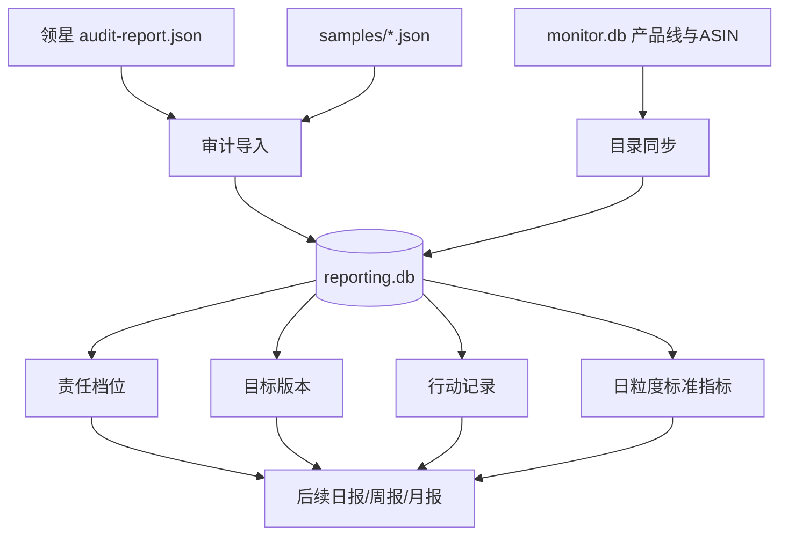

# 报告程序第二阶段：统一数据层

## 本阶段范围

本阶段建立经营报告的数据基础，不调用 DeepSeek，也不生成正式 Word 日报、周报或月报。

新增能力：

- 独立数据库 `data/reporting.db`；
- 导入最近一次领星接口盘点；
- 保存成功接口的脱敏原始快照；
- 保存权限失败、参数失败和数据缺失状态；
- 从可识别的订单、售后、FBA库存和SP广告样本中提取标准日指标；
- 从现有 `monitor.db` 同步产品线和ASIN目录；
- 设置三档责任级别；
- 建立带版本的目标；
- 记录经营动作、原因、预期、复盘日期和实际结果。

## 两个程序

现有竞品监控继续使用：

```text
启动程序.bat
停止程序.bat
http://127.0.0.1:8787
```

报告数据管理使用：

```text
启动报告程序.bat
停止报告程序.bat
http://127.0.0.1:8790/reporting
```

两套服务分别运行，数据库也相互独立：

```text
data/monitor.db

data/reporting.db
```

报告程序只读取 `monitor.db` 中的产品线目录，不修改竞品历史。

## 使用顺序

1. 运行 `领星接口盘点.bat`，生成最新盘点结果；
2. 运行 `启动报告程序.bat`；
3. 在页面点击“导入最近一次领星盘点”；
4. 设置每条产品线的责任与重点档位；
5. 添加目标；
6. 记录经营行动和复盘结果。

## 三档责任级别

- `not_mine`：不归我负责；
- `normal`：我负责的普通产品；
- `key`：我负责的重点产品。

产品线档位为默认值。单个ASIN可以设置覆盖档位。

## 目标版本

相同产品线、ASIN、周期和指标再次保存时：

- 新目标版本号加一；
- 旧目标标记为 `superseded`；
- 历史目标不会被覆盖或删除。

## 行动记录

行动状态包括：

- `planned`：计划中；
- `in_progress`：执行中；
- `completed`：已完成；
- `cancelled`：已取消。

每条行动可以保存：

- 动作类型和具体内容；
- 原因；
- 预期结果；
- 复盘日期；
- 实际结果；
- 来源是用户确认还是未来的AI建议。

## 当前领星接口状态

根据 `20260804-174447` 盘点结果：

可用：

- 访问令牌；
- 店铺；
- 本地产品；
- 平台订单；
- 售后订单；
- FBA库存；
- 广告账号；
- SP商品广告报表。

受权限限制：

- 亚马逊市场；
- FBA库龄；
- ASIN利润报表。

SDK模型校验失败：

- Listing。

第二阶段会把这些状态完整保存。缺少利润权限时，不会生成虚构利润指标。

## 数据流



## 暂未包含

- DeepSeek分析；
- Word模板渲染；
- 自动定时抓取；
- 自动日报、周报、月报；
- 利润缺失时的替代计算；
- 目标Excel批量导入。
