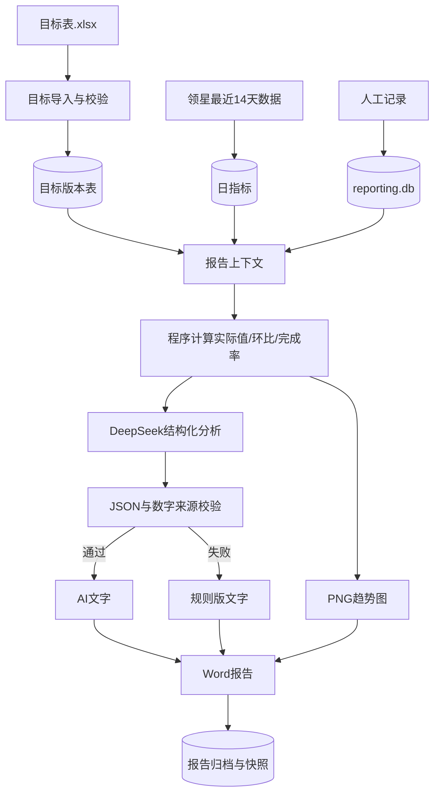
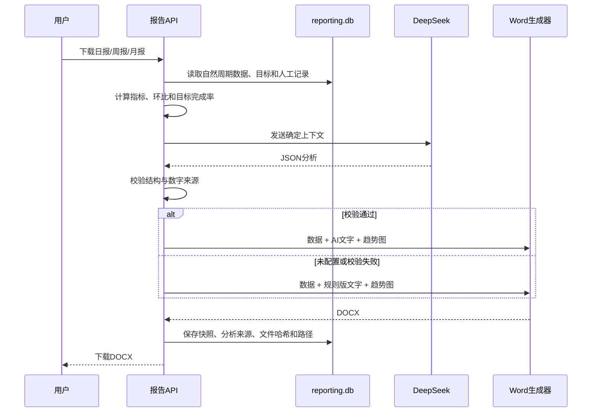

# 经营报告下一阶段：目标、分析、图表与归档

## 范围

本阶段继续只开发领星经营报告，不接入竞品。

- 目标从项目根目录 `目标表.xlsx` 读取，不在网页填写；
- 同一目标重新导入时保留旧版本，最新版本生效；
- 日报、周报、月报按自然日、自然周、自然月口径匹配目标；
- DeepSeek只生成文字，程序验证JSON结构和数字来源；
- Word嵌入销售、广告、库存趋势图；
- 每次生成报告都保存数据、目标、人工记录、分析和DOCX哈希快照。

## 数据流

## 报告生成时序

## 目标表字段

| 字段 | 说明 |
|---|---|
| 周期类型 | 日、周、月 |
| 周期 | `2026-08-06`、`2026-W32`、`2026-08` |
| 产品线 | 例如足球门 |
| 店铺SID/ASIN/MSKU | 全空为产品线目标；填写任一项为单品目标 |
| 销售额/销量/利润/利润率/TACOS/广告花费/FBA库存目标 | 可按需填写 |
| 备注 | 目标口径说明 |

## 失败处理

- Excel列、周期或数值错误：整次导入失败并指出行号；
- 相同文件重复导入：识别哈希并保持幂等；
- 利润接口无权限：利润目标保留，但实际值与完成率显示缺失；
- DeepSeek超时、非JSON或引入上下文外数字：回退规则版并记录原因；
- 报告归档保存文件SHA-256，历史报告可重新下载。
