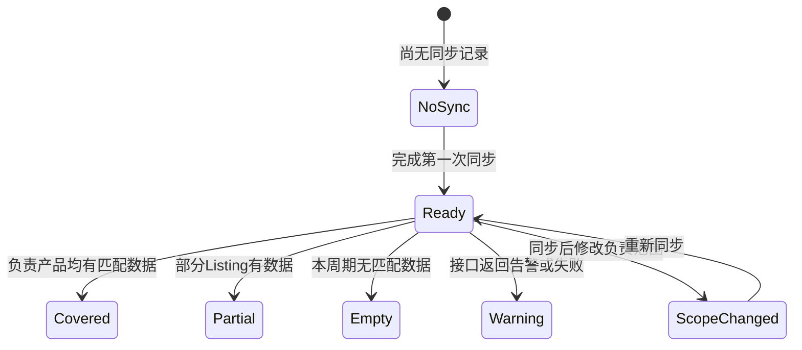

# 经营报告第四阶段：真实数据验收与同步可观测性

## 范围

本阶段继续只处理领星经营报告，不接入竞品，不改变目标表和报告正文口径。

目标：

- 将最近一次领星同步转成可阅读、可导出的验收结果；
- 区分接口失败、接口告警、本周期无数据和部分Listing有数据；
- 按产品线核对负责产品、店铺、国家和四类接口的数据覆盖；
- 对同步后修改负责范围的情况给出重新同步提示；
- 验收结果只读取本地 `reporting.db`，不重复调用领星接口；
- 输出Markdown和JSON，便于真实账号验收与后续问题定位。

## 数据流

```mermaid
flowchart TD
    LX[领星 OpenAPI] --> SYNC[最近14天同步]
    SYNC --> RUN[(lx_sync_runs)]
    SYNC --> METRIC[(lx_daily_metrics)]
    SETTING[重点/普通产品设置] --> LISTING[(lx_listings)]
    RUN --> ACCEPT[同步验收构建器]
    METRIC --> ACCEPT
    LISTING --> ACCEPT
    ACCEPT --> API[/api/reporting/acceptance/latest]
    ACCEPT --> MD[Markdown验收报告]
    ACCEPT --> JSON[JSON验收报告]
    API --> UI[设置页同步验收面板]
```

## 验收状态



接口覆盖只表示“本周期内有匹配数据的Listing比例”，不直接判断经营是否正常：

- 销售订单为空，可能代表周期内没有订单；
- 售后订单为空，可能代表周期内没有退款或退货；
- SP广告为空，可能代表没有广告活动；
- FBA库存只检查每个Listing是否存在周期内最新库存记录，不要求每天都有库存记录。

## 页面

设置页增加“同步验收”模块，展示：

- 最近一次同步状态和14天窗口；
- 活跃Listing、当前负责产品、重点、普通、产品线和指标写入量；
- 销售订单、售后订单、FBA库存和SP广告的覆盖情况；
- 每个产品线的Listing、店铺、国家和接口匹配数量；
- 授权、认证、403和负责范围变化等阻塞问题；
- Markdown和JSON导出入口。

## 接口

| 接口 | 用途 |
|---|---|
| `GET /api/reporting/acceptance/latest` | 返回最近一次同步验收JSON |
| `GET /api/reporting/acceptance/export?file_format=md` | 导出Markdown |
| `GET /api/reporting/acceptance/export?file_format=json` | 导出JSON |

## 失败处理

- 没有同步记录：返回 `no_sync`，不报500；
- 没有负责产品：明确提示同步会跳过经营数据；
- 最近同步时负责产品数量与当前设置不同：提示重新同步；
- 权限、认证、403或白名单告警：列入阻塞问题；
- 未知导出格式：返回400；
- 验收报告不读取 `.env`，不输出AppID、AppSecret、Token或请求签名。

## 测试

- 无同步记录；
- 销售部分覆盖、库存完整覆盖、售后空数据；
- 广告接口403告警；
- 同步后负责范围变化；
- 产品线和店铺聚合；
- Markdown与JSON导出；
- 未知格式拒绝；
- 设置页JavaScript语法与8790真实启动回归。
