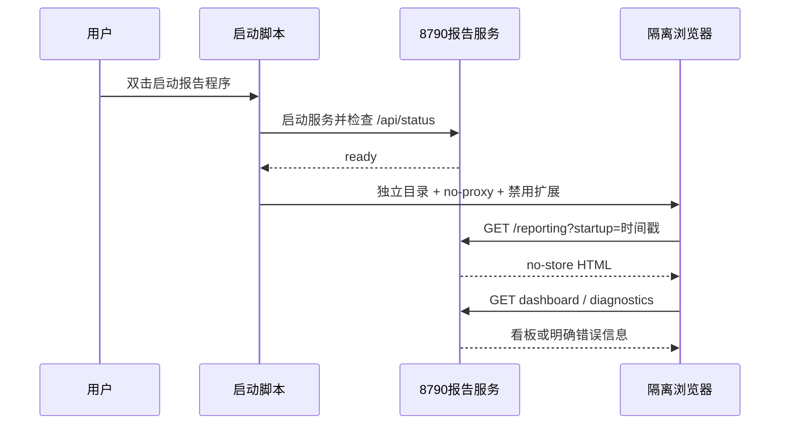

# 经营报告本机网络与黑屏恢复

## 问题

报告启动脚本使用无代理HTTP客户端检查 `127.0.0.1:8790`，但随后通过系统默认浏览器打开页面。VPN、系统代理或浏览器扩展可能继续代理回环地址，导致服务实际正常而浏览器显示网络不可用。关闭VPN后，旧标签页仍可能保留错误页或缓存状态。

## 修复

- 8790服务进程显式补充 `NO_PROXY/no_proxy=127.0.0.1,localhost`；
- 使用独立浏览器用户目录 `data/reporting-browser-profile`；
- 启动参数包含 `--no-proxy-server`、`--disable-extensions` 和 `--app=`；
- 每次打开附加时间戳，避免复用错误页面；
- 报告HTML、API和专用静态资源返回 `Cache-Control: no-store`；
- 新增 `/api/reporting/diagnostics`，只返回配置状态，不返回AppID或AppSecret；
- 前端5秒未完成启动时显示可见诊断，不再停留为空白页。

## 流程

```mermaid
flowchart TD
    BAT[启动报告程序.bat] --> PS[start_reporting.ps1]
    PS --> ENV[补充 localhost/127.0.0.1 NO_PROXY]
    PS --> UV[启动或复用 8790 Uvicorn]
    UV --> HEALTH[无代理健康检查]
    HEALTH --> OPEN[open_reporting.ps1]
    OPEN --> PROFILE[独立浏览器用户目录]
    PROFILE --> DIRECT[禁用代理与扩展]
    DIRECT --> PAGE[打开带时间戳的本机报告页]
    PAGE --> API[/api/reporting/diagnostics]
    PAGE --> DASH[/api/reporting/dashboard]
```


